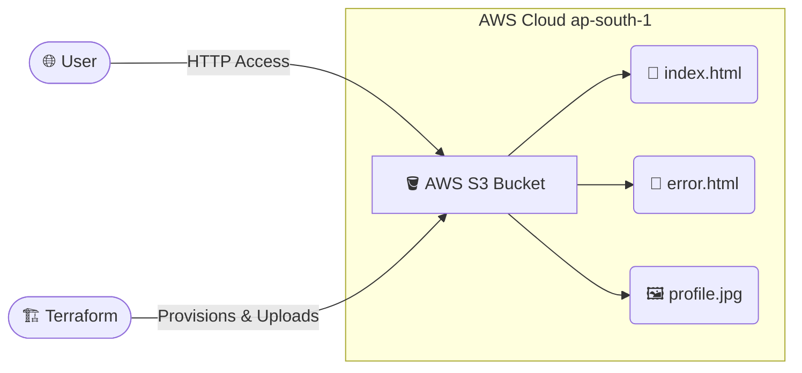

# ☁️ Terraform AWS S3 Static Website Deployment


An end-to-end Infrastructure as Code (IaC) project that provisions and configures a **static portfolio website** on **AWS S3** using **HashiCorp Terraform**. 

This project demonstrates how to automate the entire lifecycle of a web presence—from bucket creation and public access configuration to deploying HTML, CSS, and image assets—entirely via code.

## 🏗️ Architecture



## 🚀 Features

- **Infrastructure as Code (IaC)**: Eliminates manual clicks in the AWS Console. Everything is automated.
- **S3 Bucket Provisioning**: Automated creation of a globally unique bucket.
- **Static Website Hosting**: Fully configured `index.html` and `error.html` documents.
- **Security & Permissions**: 
  - Bucket Ownership Controls set to `BucketOwnerEnforced`.
  - Public Access Blocks disabled for public web hosting.
  - ACLs set to `public-read` for object accessibility.
- **Asset Deployment**: Automates the uploading of web assets directly from the repository.
- **Outputs**: Automatically prints the live website endpoint URL to the terminal upon successful deployment.

## 📁 Project Structure

```text
terraform-s3-static-website/
├── outputs/          # Folder containing project execution screenshots and terminal outputs
├── .gitignore        # Git ignore file for Terraform state and plugins
├── providers.tf      # AWS Provider configuration (e.g., ap-south-1)
├── variables.tf      # Variable definitions (bucket name, etc.)
├── main.tf           # Core resources: S3 Bucket, Ownership, ACL, Objects
├── outputs.tf        # Output variables (website endpoint)
├── index.html        # Portfolio home page
├── error.html        # Custom 404 error page
└── profile.jpg       # Sample profile image
```

## 🛠️ Prerequisites

Before running this project, ensure you have the following installed and configured:

1.  **AWS Account**: A valid AWS account with an IAM user that has administrative or S3 full-access permissions.
2.  **Terraform**: Installed on your local machine (v1.x recommended).
    ```bash
    terraform --version
    ```
3.  **AWS CLI**: Configured with your AWS credentials (`Access Key ID` and `Secret Access Key`).
    ```bash
    aws configure
    ```

## ⚙️ Configuration

### 1. Set your unique Bucket Name (`variables.tf`)
Amazon S3 bucket names must be globally unique. Edit the `variables.tf` file to set your own custom bucket name:
```hcl
variable "bucket_name" {
  description = "The globally unique name for the S3 bucket"
  type        = string
  default     = "arjunrvk-portfolio-website-bucket" # CHANGE THIS
}
```

### 2. Set your Provider Region (`providers.tf`)
The default region is set to `ap-south-1`. You can change this in `providers.tf` if you prefer a different AWS region.

## 🏃‍♂️ Quick Start

Follow these simple steps to deploy your portfolio to the cloud in seconds:

**1. Initialize Terraform**
Downloads the necessary AWS provider plugins and initializes the backend.
```bash
terraform init
```

**2. Plan the Deployment**
Review the execution plan to see exactly what AWS resources Terraform will create.
```bash
terraform plan
```

**3. Apply the Infrastructure**
Execute the deployment. This provisions the infrastructure and uploads your website files.
```bash
terraform apply -auto-approve
```

**4. Access Your Website**
Once applied, Terraform will output your live website URL in the terminal.
```bash
# Example Output:
# endpoint = "[http://arjunrvk-portfolio-website-bucket.s3-website.ap-south-1.amazonaws.com](http://arjunrvk-portfolio-website-bucket.s3-website.ap-south-1.amazonaws.com)"
```
Click the link to view your live site!

## 📝 Key Terraform Resources Used

| Resource Type | Purpose | Key Configuration |
| :--- | :--- | :--- |
| `aws_s3_bucket` | Creates the root storage bucket | Uses unique name variable |
| `aws_s3_bucket_ownership_controls` | Enforces bucket owner access | `ObjectWriter` / `BucketOwnerPreferred` |
| `aws_s3_bucket_public_access_block` | Disables public access blocks | `false` for all blocking options |
| `aws_s3_bucket_acl` | Sets object permissions | `public-read` |
| `aws_s3_object` | Uploads HTML and Image files | Source path, ACL, `content_type` mapping |
| `aws_s3_bucket_website_configuration` | Enables static web hosting | Maps `index_document` & `error_document` |

## 🧹 Cleanup

To prevent ongoing AWS charges, you can tear down all the created resources with a single command:

```bash
terraform destroy -auto-approve
```
## 👨‍💻 Author

**Arjun Vijayakumar**
- **GitHub**: [@arjunrvk2502](https://github.com/arjunrvk2502)
- **Role**: Aspiring Cloud/DevOps Engineer
- **LinkedIn**: [Arjun Vijayakumar](https://www.linkedin.com/in/arjun-vijayakumar-a5609932a/)

## 📄 License

This project is open-source and available for educational purposes. 

---
